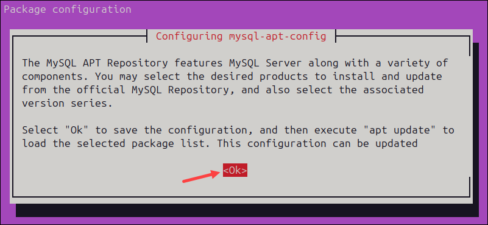
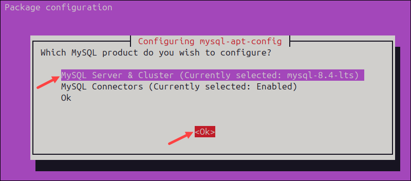
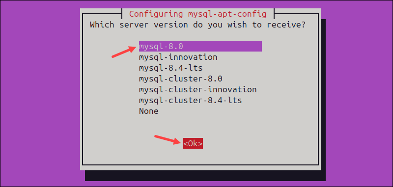
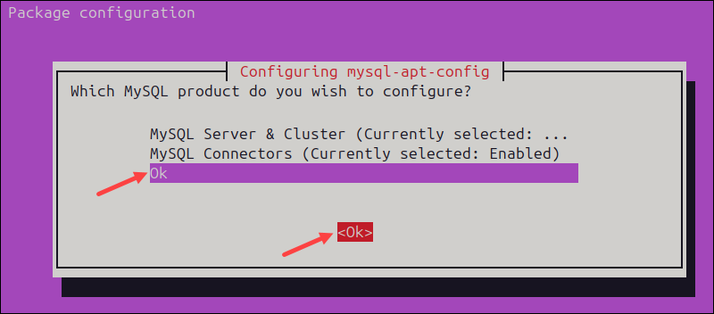

# install mysql-server in ubuntu
```
sudo apt update
sudo apt install -y mysql-server

# check version
mysql --version

# To login first time use sudo privileges
sudo mysql -u root -p;
# It will promt for password, just press enter

show databases;

use mysql;

update user set plugin='mysql_native_password' where user='root';

flush privileges;

exit

# Once you exit from mysql
# Now you can login without root privileges and without password
```

### Create user and password
```
sudo mysql

create user 'raghib'@'localhost' identify by 'raghib123';

grant all privileges om *.* to 'raghib'@'localhost';

exit
```

# Install mysql workbench
```
# Download deb file of mysql workbeach
# Download Link https://dev.mysql.com/downloads/repo/apt/
# Get deb download link

mkdir /opt/mysql
cd /opt/mysql

dpkg -i mysql-apt-config_0.8.33-1_all.deb
```







```
sudo apt update

sudo snap install mysql-workbench-community
```